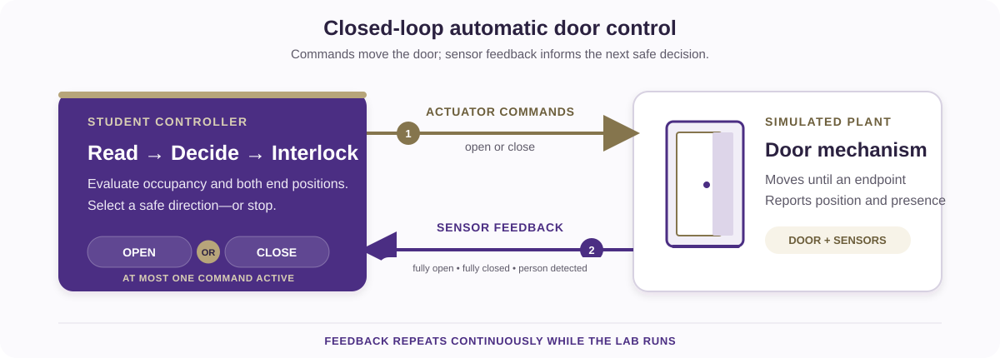

# Automatic Door Controller

Design, implement, and test a controller for an automatic glass door. The
simulation provides a person detector and two end-position sensors. Your VHDL
design commands the door to open or close without driving against an end stop
or issuing contradictory commands.

This activity is based on the original WebLab-Deusto glass-door remote
laboratory exercise. The assignment and its characteristic test scenarios are
preserved here, while the completed implementation is provided separately to
verified instructors.



## Learning objectives

After completing the activity, you should be able to:

- translate a physical control problem into explicit states and transitions;
- implement a synchronous controller in VHDL;
- map logical signals to the DE1-SoC virtual GPIO interface;
- enforce mutually exclusive actuator commands and endpoint interlocks;
- test normal operation, command reversal, group arrival, and sensor faults;
- explain how feedback keeps a controller from driving beyond a physical limit.

## Prerequisites

You should already know basic VHDL entities, architectures, processes, and
`std_logic` signals. You also need access to the DE1-SoC VHDL Code-IDE and the
REDTAIL Door simulation through your institution or laboratory provider.

Before starting, open the [REDTAIL Door simulation](https://redtail.rhlab.ece.uw.edu/simulations/door)
and the [DE1-SoC mapping page](https://redtail.rhlab.ece.uw.edu/simulations/door/devices/fpga-de1-soc/docs/10-i-o-mapping-for-altera-de1-soc.md).

## System behavior

The plant exposes three active-high inputs:

| Input | Meaning |
| --- | --- |
| `doorOpened` | The door has reached the fully open limit. |
| `doorClosed` | The door has reached the fully closed limit. |
| `personSensor` | At least one person is waiting or passing through the detection area. |

Your controller produces two active-high outputs:

| Output | Meaning |
| --- | --- |
| `open` | Drive the door toward the open limit. |
| `close` | Drive the door toward the closed limit. |

The controller must satisfy all of the following requirements:

1. Open the door when a person is detected.
2. Keep opening until the fully open sensor is active, even if a short person
   pulse ends before the door reaches that endpoint.
3. Keep the door open while a person or group remains in the detection area.
4. Close the door after the detection area is clear.
5. Stop closing at the fully closed sensor.
6. If a person arrives while the door is closing, stop closing and reopen it.
7. Never assert `open` and `close` at the same time.
8. Never continue asserting an actuator after its matching endpoint is active.

## DE1-SoC signal mapping

`V_GPIO` indices refer to the LabsLand virtual GPIO bus, not to the printed
GPIO header numbers on the board.

| Runtime signal | VHDL signal | Direction | Virtual GPIO |
| --- | --- | --- | --- |
| Door fully open | `V_GPIO(28)` | Simulation to FPGA | 28 |
| Door fully closed | `V_GPIO(29)` | Simulation to FPGA | 29 |
| Person detected | `V_GPIO(30)` | Simulation to FPGA | 30 |
| Open command | `V_GPIO(26)` | FPGA to simulation | 26 |
| Close command | `V_GPIO(27)` | FPGA to simulation | 27 |

Use `V_BT(0)` as an active-low reset. You may mirror inputs, outputs, or a
compact state code on `G_LED` to make live debugging easier.

## Assignment

### 1. Model the controller

Draw a state diagram or transition table before writing VHDL. A three-state
model such as stopped, opening, and closing is a useful starting point, but you
must define the transitions and output rules yourself.

Identify what should happen when:

- the door starts fully closed and a person arrives;
- the person signal disappears while the door is still opening;
- the door becomes fully open while a person remains present;
- the area becomes clear while the door is open;
- a new person arrives while the door is closing.

### 2. Create the VHDL top level

Create `door_deusto.vhd` and make the entity name match the selected top-level
entity:

```vhdl
library ieee;
use ieee.std_logic_1164.all;

entity door_deusto is
    port (
        CLOCK_50 : in    std_logic;
        V_BT     : in    std_logic_vector(3 downto 0);
        V_GPIO   : inout std_logic_vector(35 downto 23);
        G_LED    : out   std_logic_vector(9 downto 0) := (others => '0')
    );
end entity door_deusto;
```

Complete the architecture. Use the rising edge of `CLOCK_50` for state
updates and `V_BT(0)` for reset. Make endpoint interlocks part of the output
logic so the corresponding actuator is deasserted as soon as its limit sensor
is active.

### 3. Review safety properties

Before compiling, check these properties directly in your design:

- `open` and `close` cannot both be high;
- `doorOpened = 1` forces `open = 0`;
- `doorClosed = 1` forces `close = 0`;
- a person arriving during closing removes the close command before opening;
- reset returns the controller to a non-moving state.

### 4. Compile and program

1. Select the DE1-SoC VHDL environment.
2. Add `door_deusto.vhd` and choose `door_deusto` as the top level.
3. Select the Door simulation.
4. Synthesize the design and resolve every compilation error or warning that
   indicates an undriven or multiply driven control signal.
5. Program the FPGA and keep the simulation visible beside the board view.

## Required test sequence

Run the tests in order and record the observed sensor and command values.

| Test | Action | Expected behavior | Safety check |
| --- | --- | --- | --- |
| Initial state | Reset with the door fully closed. | The door remains stationary. | `open = 0`, `close = 0` |
| Single arrival | Send one person while closed. | The door opens to the fully open limit. | Opening stops at `doorOpened`. |
| Clear doorway | Let the person leave after the door opens. | The door closes to the fully closed limit. | Closing stops at `doorClosed`. |
| Arrival while closing | Send another person before closing completes. | The door reverses safely and reopens. | The two commands never overlap. |
| Group arrival | Keep the person sensor active for multiple arrivals. | The door stays fully open until the area is clear. | It does not close through the group. |
| Repeated cycles | Repeat the sequence several times. | Every cycle completes without getting stuck. | No actuator remains active at an endpoint. |

## Sensor-fault extension

The original activity asks you to inject door-sensor errors and observe the
result. If fault controls are available, test these cases without changing the
plant while the door is moving:

- both endpoint sensors high;
- neither endpoint sensor high while the door appears stationary;
- an endpoint signal that does not activate when the door reaches the limit.

For each case, describe what the controller does, whether that response is
safe, and what additional fault policy would improve it. Do not assume that a
contradictory sensor combination represents a valid physical position.

## Deliverables

Submit:

- your state diagram or transition table;
- `door_deusto.vhd` with clear signal and state names;
- evidence for every required test, such as a short observation table,
  waveform, or instructor-approved demonstration;
- a brief explanation of the reversal behavior and endpoint interlocks;
- your sensor-fault analysis.

## Optional challenges

- Add a configurable hold-open delay after the person sensor clears.
- Synchronize the three plant inputs before using them in the state machine.
- Add assertions in a simulation testbench for mutual exclusion and endpoint
  interlocks.
- Compare a state-machine implementation with a purely combinational policy.

## Completion checklist

- The entity and filename match the selected top level.
- The virtual GPIO indices match the REDTAIL mapping.
- A short person pulse still results in a complete opening cycle.
- A group keeps the door open.
- A person arriving during closing causes a safe reversal.
- Both endpoint interlocks work.
- `open` and `close` are never high together.
- All required evidence and source files are ready to submit.
