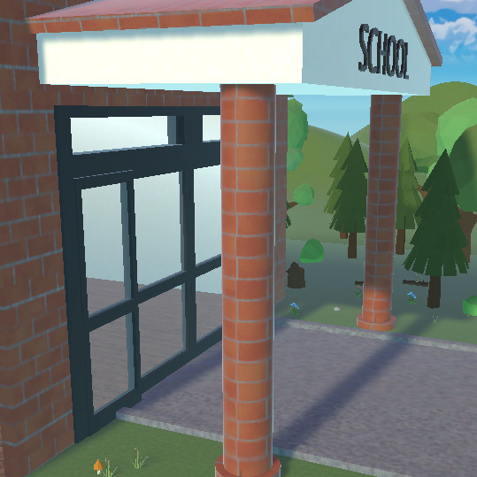

# Automatic Door Controller

Implement and test an automatic glass-door controller on the STM32
NUCLEO-WB55RG. The simulation provides a person detector and two end-position
sensors. Your Mbed application commands opening and closing while protecting
the mechanism at its endpoints.

The Door 3D simulation and original remote-laboratory exercise were created by
[WebLab-Deusto at the University of Deusto in Spain](https://weblab.deusto.es).
This lesson adapts that activity to the STM32/Mbed workflow while preserving its
operating problem, group-arrival behavior, reversal test, and sensor-fault
extension. The completed application is provided separately to verified
instructors.




## Learning objectives

After completing the activity, you should be able to:

- translate physical control requirements into Boolean command rules;
- configure Mbed digital inputs and outputs for a remote simulation;
- use endpoint feedback to prevent an actuator from driving beyond a limit;
- implement break-before-make reversal between opposing commands;
- test normal operation, reversal, group arrival, and sensor faults;
- explain the difference between a requested motion and confirmed position.

## Prerequisites

You should know basic C++ control flow and Mbed `DigitalIn` and `DigitalOut`.
You also need access to the NUCLEO-WB55RG Mbed Code-IDE and the REDTAIL Door
simulation through your institution or laboratory provider.

Before starting, open the [REDTAIL Door simulation](https://redtail.rhlab.ece.uw.edu/simulations/door)
and the [STM32 mapping page](https://redtail.rhlab.ece.uw.edu/simulations/door/devices/stm32-nucleo-wb55rg/docs/11-i-o-mapping-for-stm32-nucleo-wb55rg.md).

## System behavior

The plant exposes three active-high inputs:

| Input | Meaning |
| --- | --- |
| `doorOpened` | The door has reached the fully open limit. |
| `doorClosed` | The door has reached the fully closed limit. |
| `personSensor` | At least one person is waiting or passing through the detection area. |

Your application produces two active-high outputs:

| Output | Meaning |
| --- | --- |
| `open` | Drive the door toward the open limit. |
| `close` | Drive the door toward the closed limit. |

The application must satisfy all of the following requirements:

1. Open the door while a person is detected and the door is not fully open.
2. Stop opening when the fully open sensor is active.
3. Keep the door open while a person or group remains in the detection area.
4. Close the door while the area is clear and the door is not fully closed.
5. Stop closing when the fully closed sensor is active.
6. If a person arrives while the door is closing, remove the close command
   before asserting the open command.
7. Never assert `open` and `close` at the same time.

Unlike the VHDL version, this basic Mbed exercise uses a fast polling loop
rather than requiring a state machine. The sensor feedback and output ordering
still form a real closed-loop controller.

## STM32 signal mapping

All signals are active high. Directions are relative to your STM32 program.

| Runtime signal | Mbed pin | Direction | Purpose |
| --- | --- | --- | --- |
| Door fully open | `PC_13` | Input | Stop the open command at the open endpoint. |
| Door fully closed | `PA_6` | Input | Stop the close command at the closed endpoint. |
| Person detected | `PB_9` | Input | Request opening and prevent closing. |
| Open command | `PC_4` | Output | Drive the simulation toward fully open. |
| Close command | `PD_0` | Output | Drive the simulation toward fully closed. |

Optional diagnostic LEDs are available on `PB_13`, `PB_14`, and `PB_15`.
You may use them to mirror the person, opened, and closed inputs.

## Assignment

### 1. Derive the command rules

Write a two-row decision table for these modes:

- a person is detected;
- the detection area is clear.

For each mode, include the matching endpoint sensor in the command rule. Then
verify from your table that the two commands cannot both be true.

### 2. Create the Mbed application

Create `main.cpp` in an Mbed OS 6 or Mbed OS CE project for
`NUCLEO_WB55RG`. Your program should follow this structure without copying a
completed command expression from another source:

```cpp
#include "mbed.h"

using namespace std::chrono_literals;

int main() {
    // Configure three DigitalIn objects and two DigitalOut objects.
    // Initialize both actuator outputs low.

    while (true) {
        // Read one snapshot of the three inputs.
        // Derive mutually exclusive open and close requests.
        // Apply outputs using break-before-make ordering.
        // Update optional diagnostic LEDs.
        ThisThread::sleep_for(10ms);
    }
}
```

Read each sensor once per loop into a local `bool`; do not repeatedly sample a
changing input while deriving one output pair.

### 3. Apply outputs safely

When changing direction, deassert the previously active command before
asserting the opposite command. A suitable control structure has three
exclusive branches:

1. opening requested;
2. otherwise, closing requested;
3. otherwise, stop.

Within the opening branch, clear `close` before setting `open`. Within the
closing branch, clear `open` before setting `close`. This break-before-make
ordering prevents even a brief software-generated overlap during reversal.

### 4. Compile and program

1. Select the NUCLEO-WB55RG Mbed environment.
2. Add or replace `main.cpp` in the project.
3. Select the Door simulation.
4. Compile the project and resolve every error or pin-name warning.
5. Program the board and keep the simulation visible beside the board view.

## Required test sequence

Run the tests in order and record the observed sensor and command values.

| Test | Action | Expected behavior | Safety check |
| --- | --- | --- | --- |
| Initial state | Start with the door fully closed and no person. | The door remains stationary. | `open = 0`, `close = 0` |
| Single arrival | Send one person while closed. | The door opens to the fully open limit. | Opening stops at `doorOpened`. |
| Clear doorway | Let the person leave after the door opens. | The door closes to the fully closed limit. | Closing stops at `doorClosed`. |
| Arrival while closing | Send another person before closing completes. | The door reverses safely and reopens. | `close` is cleared before `open` is set. |
| Group arrival | Keep the person sensor active for multiple arrivals. | The door stays fully open until the area is clear. | It does not close through the group. |
| Repeated cycles | Repeat the sequence several times. | Every cycle completes without getting stuck. | No output remains active at an endpoint. |

Use the optional LEDs to distinguish an input-mapping problem from an output
logic problem. If the LEDs do not follow the simulation sensors, correct the
input configuration before debugging the command rules.

## Sensor-fault extension

The original activity asks you to inject door-sensor errors and observe the
result. If fault controls are available, test:

- both endpoint sensors high;
- neither endpoint sensor high while the door appears stationary;
- an endpoint signal that does not activate when the door reaches the limit.

For each case, record the commands produced by your program, decide whether the
response is safe, and propose a conservative fault policy. Do not treat a
contradictory sensor combination as a valid physical position.

## Deliverables

Submit:

- your command decision table;
- `main.cpp` with descriptive pin and command names;
- evidence for every required test, such as an observation table or
  instructor-approved demonstration;
- a brief explanation of endpoint interlocks and break-before-make reversal;
- your sensor-fault analysis.

## Optional challenges

- Add a non-blocking hold-open timer after the person sensor clears.
- Detect contradictory endpoint sensors and enter a conservative fault state.
- Record transitions over serial output without slowing the control loop.
- Refactor the policy into a pure function and unit-test every input
  combination on a development computer.

## Completion checklist

- The Mbed target is `NUCLEO_WB55RG`.
- All five pins match the REDTAIL mapping.
- Both actuator outputs initialize low.
- Each loop uses one consistent input snapshot.
- A group keeps the door open.
- A person arriving during closing causes a safe reversal.
- Both endpoint interlocks work.
- `open` and `close` are never high together, including during reversal.
- All required evidence and source files are ready to submit.
