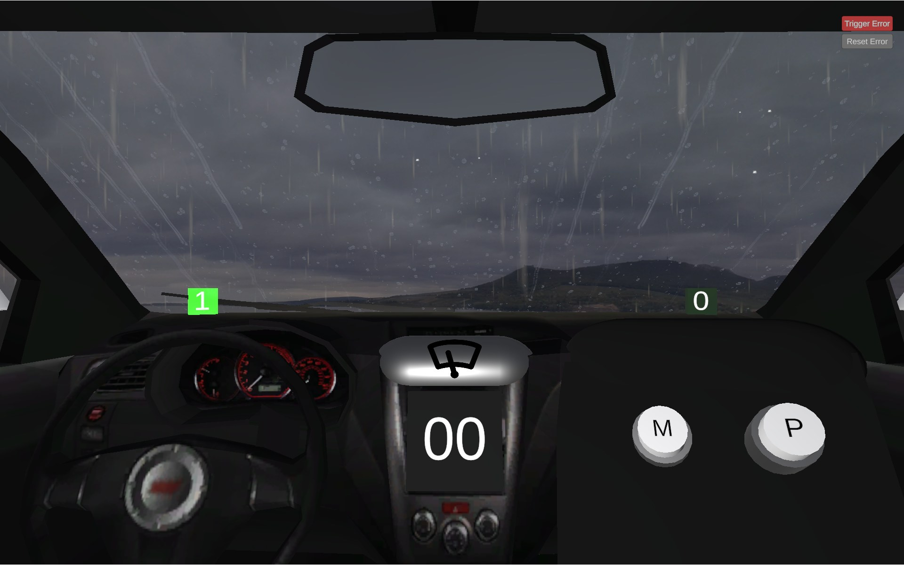
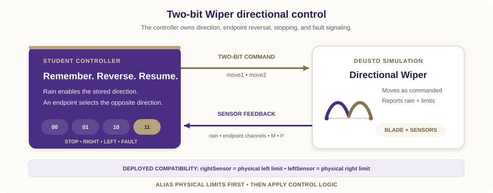

# Directional Wiper Controller

Build a two-bit SystemVerilog controller that remembers the windshield-wiper
travel direction and reverses it at each endpoint. The simulation animates the
blade, while your module owns stop, direction, and fault commands.

The Wiper 2-Bit 3D simulation and original remote-laboratory exercise were
created by [Giovanna Lani and WebLab-Deusto at the University of Deusto in
Spain](https://weblab.deusto.es). This lesson adapts their directional
challenge to REDTAIL's current SystemVerilog workflow and mapping. The
completed implementation is available separately to verified instructors.





## Learning objectives

After completing the activity, you should be able to:

- implement a small state machine with `always_ff` and `always_comb`;
- encode four command meanings on a two-bit output;
- preserve travel direction while movement is paused;
- reverse safely at physical endpoints;
- use semantic aliases to contain an external naming mismatch;
- verify reset, sequence, fault, and button-isolation behavior.

## Prerequisites

You should know SystemVerilog modules, enumerated types, blocking versus
nonblocking assignments, `always_ff`, and `always_comb`. You need the DE1-SoC
SystemVerilog Code-IDE and the Wiper 2-Bit simulation.

Open the [REDTAIL Wiper 2-Bit simulation](https://redtail.rhlab.ece.uw.edu/simulations/wiper-2-bit)
and the [current DE1-SoC mapping](https://redtail.rhlab.ece.uw.edu/simulations/wiper-2-bit/devices/fpga-de1-soc/docs/20-i-o-mapping-for-altera-de1-soc.md)
before starting.

## Compatibility contract

The deployed endpoint channel names are reversed relative to physical position:

| Runtime input | Physical meaning |
| --- | --- |
| `rightSensor` | Blade is at the **physical left-hand limit**. |
| `leftSensor` | Blade is at the **physical right-hand limit**. |

Immediately alias these signals as `at_left_limit` and `at_right_limit` and
write the controller in physical terms. Do not swap pins or alter the deployed
channel names.

## Required behavior

The pair `{move1, move2}` uses this contract:

| `move1` | `move2` | Physical command |
| ---: | ---: | --- |
| 0 | 0 | Stop |
| 0 | 1 | Move physically right |
| 1 | 0 | Move physically left |
| 1 | 1 | Fault |

Rain enables movement; dry conditions stop without erasing direction. Begin
toward the physical right after reset, reverse at each endpoint, output `11`
for simultaneous endpoints, and keep M/P outside the core policy.

## DE1-SoC signal mapping

| Runtime signal | SystemVerilog access | Direction | Semantic use |
| --- | --- | --- | --- |
| M button | `V_GPIO[23]` | Simulation to FPGA | Optional extension |
| P button | `V_GPIO[24]` | Simulation to FPGA | Optional extension |
| `move1` | `V_GPIO[26]` | FPGA to simulation | First command bit |
| `move2` | `V_GPIO[27]` | FPGA to simulation | Second command bit |
| Rain sensor | `V_GPIO[28]` | Simulation to FPGA | Movement request |
| `rightSensor` | `V_GPIO[29]` | Simulation to FPGA | **Physical left limit** |
| `leftSensor` | `V_GPIO[30]` | Simulation to FPGA | **Physical right limit** |
| Reset | `V_BT[0]` | Board to design | Active low |

The REDTAIL mapping is authoritative over endpoint tables in older guide
versions.

Use only `V_GPIO[35:23]`; lower lanes alias `V_BT` pins in the shared constraints
and must not appear beside `V_BT` in the same top level.

## Assignment

### 1. Design the state machine

Use two named direction states. Draw endpoint transitions and identify the
conditions that preserve state. Rain should gate the output only; a dry pause
must not reset the direction register.

<!-- docx-page-break -->

### 2. Create the module

Create `wiper_2bit_deusto.sv`:

```systemverilog
module wiper_2bit_deusto (
    input  logic        CLOCK_50,
    input  logic [3:0]  V_BT,
    inout  wire [35:23] V_GPIO,
    output logic [9:0]  G_LEDR
);
    // Alias deployed endpoint names to physical limits.
    // Store direction in always_ff; derive commands in always_comb.
    // Drive only V_GPIO[26] and V_GPIO[27].
endmodule
```

Complete the module yourself. Give every combinational path a default, keep
sequential and output logic separate, and assign all diagnostic LED bits.

### 3. Review priority and assertions

Give simultaneous endpoints highest command priority. Make a coherent endpoint
override the registered direction immediately, then update the direction state
on the clock. Add or describe assertions that reject unknown/invalid commands
and verify that dry cycles retain direction.

### 4. Compile and program

1. Select the DE1-SoC SystemVerilog environment and Wiper 2-Bit simulation.
2. Add the `.sv` source and select its matching top level.
3. Synthesize and resolve relevant latch, width, unknown, or multiple-driver warnings.
4. Program the FPGA and compare command bits with physical motion.

## Required test sequence

| Test | Action | Expected command and behavior |
| --- | --- | --- |
| Reset, dry | Reset and release with rain off. | `00`; default direction is right. |
| Rain start | Enable rain between endpoints. | `01`; move physically right. |
| Right endpoint | Assert `leftSensor`. | `10`; reverse physically left. |
| Dry pause/resume | Pause while moving left, then restore rain. | `00`, then `10`; direction persists. |
| Left endpoint | Assert `rightSensor`. | `01`; reverse physically right. |
| Button isolation | Toggle M and P while dry. | `00`; core direction and command do not change. |
| Sensor fault | Assert both endpoint inputs. | `11`. |
| Fault recovery | Clear the contradiction with rain active. | Coherent endpoint or stored direction determines travel. |

## Deliverables

Submit the state diagram, `wiper_2bit_deusto.sv`, compatibility aliases,
assertion or test results, live test evidence, and an explanation of dry-state
retention and fault priority.

## Optional extensions

- Define a documented manual role for M or P.
- Synchronize the external inputs before state transitions.
- Latch and acknowledge a visible diagnostic fault.
- Add functional coverage for every command and transition.

## Completion checklist

- The source is SystemVerilog and uses explicit sequential/combinational logic.
- Endpoint names are translated to physical aliases exactly once.
- Direction reverses at each physical endpoint and persists while dry.
- Dual endpoints produce `11`; M and P do not affect the core.
- Reset and every required sequence have been verified.
