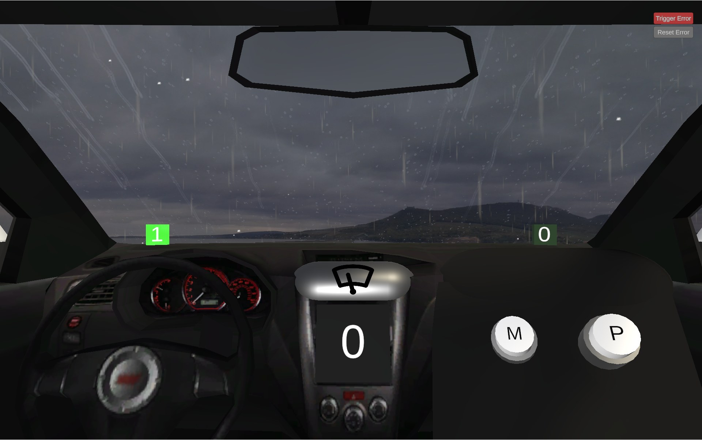
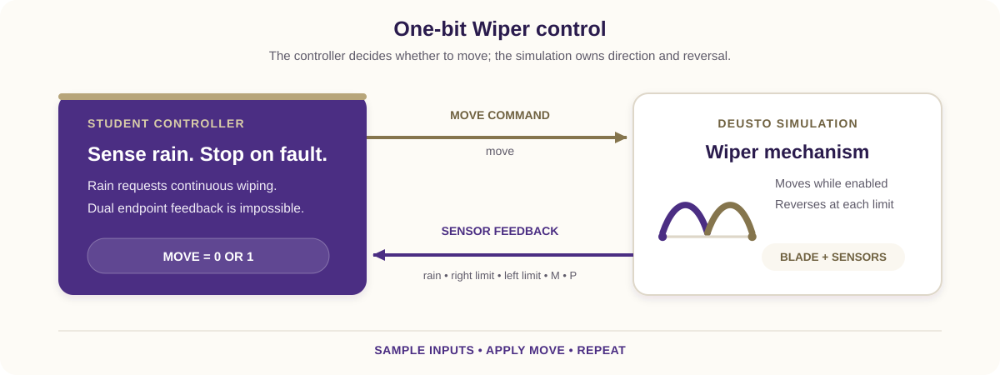

# Rain-Responsive Wiper Controller

Design and test a one-bit controller for a simulated vehicle windshield wiper.
Your VHDL design decides whether the blade should move. The simulation owns the
blade angle and reverses direction automatically at the two endpoints.

The Wiper 3D simulation and original remote-laboratory exercise were created by
[Giovanna Lani and WebLab-Deusto at the University of Deusto in Spain](https://weblab.deusto.es).
This lesson adapts their rain-driven VHDL challenge to the current REDTAIL
mapping. The completed implementation is provided separately to verified
instructors.





## Learning objectives

After completing the activity, you should be able to:

- translate a physical requirement into a Boolean control rule;
- implement combinational control logic in VHDL;
- map simulation signals to the DE1-SoC virtual GPIO interface;
- distinguish controller-owned behavior from simulation-owned behavior;
- detect an impossible endpoint-sensor combination and stop conservatively;
- test normal movement, automatic reversal, pause, resume, and fault behavior.

## Prerequisites

You should know VHDL entities, architectures, concurrent assignments or simple
processes, and `std_logic`. You also need the DE1-SoC VHDL Code-IDE and access
to the Wiper simulation through your institution or laboratory provider.

Before starting, open the [REDTAIL Wiper simulation](https://redtail.rhlab.ece.uw.edu/simulations/wiper)
and the [current DE1-SoC mapping](https://redtail.rhlab.ece.uw.edu/simulations/wiper/devices/fpga-de1-soc/docs/18-i-o-mapping-for-altera-de1-soc.md).

## System behavior

The simulation provides five active-high inputs:

| Input | Meaning in the current simulation |
| --- | --- |
| `rainSensor` | Rain is active and automatic wiping is requested. |
| `rightSensor` | The blade is within the right endpoint range. |
| `leftSensor` | The blade is within the left endpoint range. |
| `mButton` | Optional M button; not required by the core assignment. |
| `pButton` | Optional P button; not required by the core assignment. |

Your controller produces one active-high output:

| Output | Meaning |
| --- | --- |
| `move` | `1` allows the blade to move; `0` pauses it at its current angle. |

The core controller must satisfy all of these requirements:

1. Assert `move` while rain is active.
2. Deassert `move` when rain is not active.
3. Do not command direction; the one-bit simulation reverses automatically.
4. If both endpoint sensors are high together, deassert `move` because that
   combination cannot represent one physical blade position.
5. The M and P buttons must not affect the core solution.

## DE1-SoC signal mapping

`V_GPIO` indices are positions on the LabsLand virtual bus, not printed board
header numbers.

| Runtime signal | VHDL access | Direction |
| --- | --- | --- |
| M button | `V_GPIO(23)` | Simulation to FPGA |
| P button | `V_GPIO(24)` | Simulation to FPGA |
| Move | `V_GPIO(26)` | FPGA to simulation |
| Rain sensor | `V_GPIO(28)` | Simulation to FPGA |
| Right endpoint | `V_GPIO(29)` | Simulation to FPGA |
| Left endpoint | `V_GPIO(30)` | Simulation to FPGA |

You may mirror the inputs and `move` on `G_LED` for live diagnosis. The current
REDTAIL mapping above is authoritative; do not copy endpoint descriptions from
older development notes.

## Assignment

### 1. Derive the policy

Create a truth table using rain and the two endpoint inputs. Include normal
right-endpoint and left-endpoint rows, plus the impossible row in which both
endpoint inputs are high. State why stopping is the conservative response.

### 2. Create the VHDL top level

Create `wiper_deusto.vhd` and select `wiper_deusto` as the top-level entity:

```vhdl
library ieee;
use ieee.std_logic_1164.all;

entity wiper_deusto is
    port (
        CLOCK_50 : in    std_logic;
        V_GPIO   : inout std_logic_vector(35 downto 23);
        G_LED    : out   std_logic_vector(9 downto 0) := (others => '0')
    );
end entity wiper_deusto;
```

Complete the architecture yourself. Read the mapped inputs, derive a single
`move` signal from the policy, and drive only `V_GPIO(26)`. Leave every
simulation-to-FPGA lane as an input.

### 3. Review the ownership boundary

Your design does not store direction and does not reverse the blade. Explain
why the endpoint sensors are still useful for diagnosis and fault detection,
even though normal reversal belongs to the simulation.

### 4. Compile and program

1. Select the DE1-SoC VHDL environment and the Wiper simulation.
2. Add `wiper_deusto.vhd` and select the matching top-level entity.
3. Synthesize the design and resolve all multiple-driver or undriven-signal
   warnings that affect the virtual GPIO interface.
4. Program the FPGA and keep the simulation visible beside the board view.

## Required test sequence

Run the tests in order and record rain, endpoint, and move values.

| Test | Action | Expected behavior |
| --- | --- | --- |
| Dry start | Start with rain disabled. | `move = 0`; the blade remains still. |
| Rain start | Enable rain. | `move = 1`; the blade starts moving. |
| Automatic reversal | Keep rain enabled through both endpoints. | The blade reverses automatically and `move` stays high. |
| Pause | Disable rain between endpoints. | `move = 0`; the blade pauses at its current angle. |
| Resume | Re-enable rain. | The blade resumes and continues automatic reversal. |
| Button isolation | Press M and P independently while dry. | The core solution remains stopped. |
| Sensor fault | Trigger both endpoint sensors together. | `move = 0` until the fault clears. |
| Recovery | Clear the fault with rain still enabled. | Normal movement resumes. |

## Deliverables

Submit your truth table, `wiper_deusto.vhd`, evidence for every required test,
and a short explanation of the controller/simulation ownership boundary and
dual-endpoint safety response.

## Optional extensions

- Give M or P a documented manual-wipe behavior without changing the core
  rain requirements.
- Latch a visible fault indicator until a board button acknowledges it.
- Add assertions for the rain rule and dual-endpoint stop.
- Synchronize the simulation inputs before using them in clocked extensions.

## Completion checklist

- All virtual GPIO indices match the current REDTAIL mapping.
- Rain starts wiping and dry conditions stop it.
- Automatic reversal is left to the simulation.
- Both endpoint sensors high forces a stop.
- M and P do not affect the core solution.
- All required evidence and source files are ready to submit.
