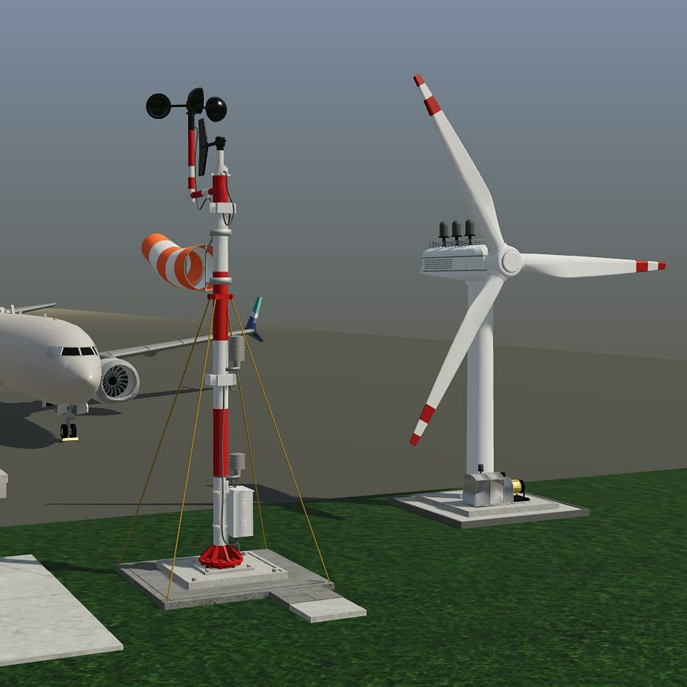

# Airport Wind Station — Usage Guide

Build a controller that turns a wind turbine toward the wind, enables generation
when it is aligned, and brings it to a safe stop when wind conditions change.
Airport Wind Station is a REDTAIL activity developed with the Remote Hub Lab
(RHLAB) at the University of Washington and integrated with LabsLand. Original
3D assets and visualization foundation: **Zhiyun (ZZ) Zhang**.

## Access and setup

Students use the laboratory access supplied by their instructor or course.
This repository provides documentation; it does not issue student laboratory
accounts or reservations. Instructors interested in using the activity can
[contact the REDTAIL team](mailto:rhlab@uw.edu?subject=REDTAIL%20Airport%20Wind%20Station%20inquiry).

1. Open your course's LabsLand laboratory and select **Airport Wind Station**
   with the hardware and language assigned by your instructor.
2. Open the supplied project or starter. Check the appropriate device mapping
   on the [Airport Wind Station page](https://redtail.rhlab.ece.uw.edu/simulations/airport-wind-station).
3. Implement and simulate your controller, then build and program the target.
4. Open the 3D simulation and confirm that its connection indicator shows
   **Connected** before testing. A disconnected scene is not a live test result.

The supported targets are the Altera DE1-SoC FPGA and STM32 Nucleo WB55RG.
Existing controller examples cover SystemVerilog, Verilog and VHDL on DE1-SoC,
and Mbed OS or C/HAL on STM32. Your course determines which project environment
and materials are available.

## What you control

The simulation supplies a two-bit wind code and an alignment sensor. Your
controller supplies four commands: align the turbine, enable generation, keep
the turbine active, and raise a runway wind alert.

The simulated environment owns the wind, turbine orientation, alignment
feedback and rotor motion. Your code must respond to its sensors; it does not
calculate the 3D animation or implement the browser communication protocol.
The angle shown on screen is a visual aid, not an additional board input.

| Input | Value | Meaning |
|---|---|---|
| `inputCode[1:0]` | `01` | Calm/negligible wind; do not generate |
| `inputCode[1:0]` | `10` | Steady wind; generation is permitted only after alignment |
| `inputCode[1:0]` | `11` | High wind; stop and raise the runway alert |
| `inputCode[1:0]` | `00` | Reserved; use the non-generating safe-stop path |
| `aligned` | `1` | Turbine is aligned with the current wind direction |
| `aligned` | `0` | Turbine needs alignment |

| Command | Meaning when high |
|---|---|
| `align` | Request turbine yaw toward the wind; movement also requires `active` and steady wind |
| `generatorEnable` | Request generation; the plant only generates with steady wind, alignment and an active turbine |
| `active` | Keep the turbine active during alignment, generation and the stopping interval |
| `runwayWindAlert` | Indicate high wind at the runway |

## Operating requirements

Use a one-second state-machine tick for the standard activity. The DE1 wrapper
runs from the 50 MHz board clock and uses a clock-enable tick; STM32 uses a
non-blocking timer while continuing to sample inputs.

The required outputs for each state are:

- **STOPPED:** `active=0`, `align=0`, `generatorEnable=0`.
- **ALIGNING:** `active=1`, `align=1`, `generatorEnable=0`.
- **GENERATING:** `active=1`, `align=0`, `generatorEnable=1`.
- **STOPPING:** `active=1`, `align=0`, `generatorEnable=0`.

Apply these transition rules:

- Start in STOPPED. With steady wind, move to ALIGNING if unaligned, or directly
  to GENERATING if already aligned.
- While wind remains steady, follow the alignment sensor: ALIGNING when it is
  low and GENERATING when it is high.
- If wind becomes calm, high or reserved while aligning or generating, enter
  STOPPING on the next state-machine tick. Enter STOPPED on the following tick,
  even if steady wind has returned in the meantime.
- Assert `runwayWindAlert` whenever the sampled wind code is `11`, without
  waiting for the one-second state-machine tick. On DE1 this follows the supplied
  input synchronizers; on STM32 it follows the input-sampling loop.

These are discrete learning requirements, not a real-world safety controller.
The scene is not a flight simulator and does not model certified aviation
operations, realistic energy production or an industrial turbine's protection
systems.

## Test the weather scenarios

| Scenario | What to check |
|---|---|
| **Calm** | The turbine remains stopped, generation is off and the runway alert is off. From an active state, observe STOPPING before STOPPED. |
| **Steady wind** | An unaligned turbine yaws only when commanded. Once aligned, yaw stops and generation begins. |
| **Wind direction change** | Alignment falls. Generation is disabled on the next controller tick; the turbine realigns, then generation resumes. |
| **High-wind gust** | The runway alert responds without waiting for the course tick. Generation stops on the next tick; the controller then becomes inactive on the following tick. |

Run the scenarios from both ALIGNING and GENERATING. Also check a repeated
scenario, a return to steady wind during STOPPING, and the reserved `00` input
in a testbench or host test. The normal weather buttons do not generate `00`.
Allow time for the one-second controller ticks and for the physical animation
to settle; rotor motion can lag a command during acceleration or spin-down.

Compare **Current outputs** with the sensor values and visible turbine behavior.
On the standard DE1 wrapper, `LEDR[1:0]` shows `00` STOPPED, `01` ALIGNING,
`10` GENERATING and `11` STOPPING. Record waveforms or test results alongside
your live observations rather than relying on animation alone.

## Two different reset operations

**Restart activity** resets the simulated environment: calm wind, initial
orientation, cleared alignment and a stopped rotor. It does **not** reset the
controller running on your board. Its existing outputs are sampled again, so
an incorrect command can still produce a warning after restarting the scene.

**Controller reset** resets the target's controller state, not the weather or
turbine geometry. On DE1-SoC, assert the supplied active-high `SW[0]` reset,
then release it. On STM32, use the target's normal reset/reboot mechanism.
With steady wind still selected, check that the controller starts safely and
then responds to the unchanged plant inputs.

The first physical input slot is reserved and must be ignored. Do not use it
as a reset input or shift the other signals to fill the unused slot.

## Troubleshooting and accessibility

- **Disconnected or stale scene:** check the laboratory session and connection
  status. Reopen the simulation within the active course session if necessary;
  do not assume a frozen picture proves that the controller is working.
- **No yaw:** check steady wind, `active`, `align`, the alignment input and the
  platform mapping. Never swap input and output pins or remove reserved slots.
- **No generation:** check steady wind, alignment and both `active` and
  `generatorEnable`. An unsafe command does not force the simulated plant to
  generate.
- **Safety notice:** inspect the displayed command values and your logic.
  Restarting the scene is not a substitute for correcting the controller.
- **Unexpected timing:** keep a one-second state tick while sampling inputs
  more frequently. Do not delay the runway alert with a blocking one-second
  sleep. Keep the supplied input synchronization on FPGA.
- Use **Reduce motion** if animation is distracting. **Signal details** and the
  text status/output displays provide information without relying only on
  color or moving objects. Weather controls are operable with the keyboard.

## Credits

- **Zhiyun (ZZ) Zhang, University of Washington:** original 3D airport and
  wind-turbine assets and visualization foundation.
- **Luis Rodríguez Gil, LabsLand:** activity integration, browser transport and
  state model, user interface, tests and multi-platform support.
- **[Remote Hub Lab (RHLAB), University of Washington](https://rhlab.ece.uw.edu/):**
  the research and teaching group developing REDTAIL.
- **[LabsLand](https://labsland.com/):** remote-laboratory platform integration.
- **Professor Rania Hussein:** RHLAB principal investigator and lab leader,
  and principal investigator for REDTAIL.

Development was supported in part by the National Science Foundation through
REDTAIL under [Award No. 2336745](https://www.nsf.gov/awardsearch/showAward?AWD_ID=2336745).
Any opinions, findings, conclusions or recommendations expressed here are those
of the authors and do not necessarily reflect the views of the National
Science Foundation.
