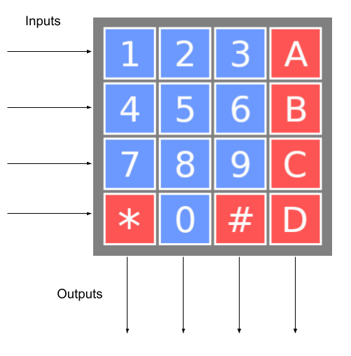

Keypad
======

The keypad has 4 inputs (from the keypad perspective) and 4 outputs (from the keypad perspective).

The 4 inputs are 4 rows:

 * Row 1: top row
 * Row 4: bottom row

The 4 outputs are the 4 columns:

 * Column 1: left column
 * Column 4: right column

Your device should be sending a '0' to all the rows except for one, and then you can collect the data of the 4 columns with the 4 outputs.

For example, to figure out if the button 6 is pressed, you have to activate the second row, by sending the following signals to the keypad inputs: `0, 1, 0, 0`. Once you do it, and wait a bit (e.g., 1ms) for the keypad to adjust, it will return which buttons in the second row are pressed. For example, it might answer `0, 0, 0, 0` (no button pressed), `1, 0, 0, 0` (button "4" pressed), `0, 0, 1, 0` (button "6" pressed).

If you want to constantly monitor which buttons are on, you have to sequentially send the signals `1, 0, 0, 0`, `0, 1, 0, 0`, `0, 0, 1, 0`, and `0, 0, 0, 1`.

This is a digital twin of the [Parallax 4x4 Matrix Membrane Keypad](https://www.parallax.com/package/membrane-keypad-documentation/){:target="_blank"}.
